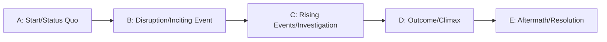

# Chronological Structure

## Overview

Events are presented strictly in the order they happen in time. Emphasizes clear causality and simplicity.

---

## Impactful Guidance

### When to use
- Instructional, procedural, documentary, simple cause→effect, clear detective progressions

### Core promise
- Chronology and presentation are identical: A → B → C → D → E

### Labeled Mermaid graph (A–E)


### Minimal template (LLM-ready)
```yaml
structure: chronological
beats: [A, B, C, D, E]
labels:
  A: Start / Status Quo
  B: Disruption / Inciting Event
  C: Rising Events / Investigation
  D: Outcome / Climax
  E: Aftermath / Resolution
constraints:
  - "Presentation order equals chronological order"
  - "Each beat advances causality"
  - "D resolves the core conflict; E establishes the new normal"
```

### Quick checklist
- Each scene advances time and causality
- No time jumps or flashbacks
- Clear payoff at D, stable new state at E

---

## Example (Detective, 60–90s)
```yaml
A: Body discovered; detective assigned
B: First clue found; suspects identified
C: Interviews + forensics connect evidence
D: Confrontation; killer confesses
E: Wrap-up; victim memorial; detective moves on
```

---

## When to avoid
- Stories relying on reveals via time manipulation
- Multi-threaded or puzzle narratives needing parallel tracks
