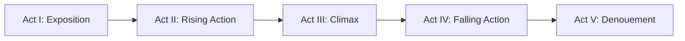

# Five-Act Structure (Freytag's Pyramid)

## Overview

The Five-Act Structure, also known as Freytag's Pyramid, is a dramatic structure that divides a story into five distinct parts. Originally developed for analyzing classical Greek and Shakespearean drama, it provides a more nuanced progression than the three-act structure, with clear rising and falling action phases.

**Origin**: Gustav Freytag (1863), based on analysis of ancient Greek and Shakespearean plays

**Best for**: Complex character arcs, tragedies, dramatic narratives, stories requiring extended tension build-up

---

## Impactful Guidance

### When to use
- Tragedy/drama, moral complexity, ensemble arcs, deep consequences

### Core promise
- A: World and stakes established
- B: Complications escalate and stakes rise
- C: Peak decision/crisis point
- D: Consequences play out deliberately
- E: Thematic closure/new order

### Labeled Mermaid graph (A–E)


### Minimal template (LLM-ready)
```yaml
structure: five_act
acts:
  - id: A_exposition
  - id: B_rising_action
  - id: C_climax
  - id: D_falling_action
  - id: E_denouement
constraints:
  - "Climax (C) is shortest/highest intensity"
  - "Acts II & IV carry extended build and consequence"
  - "Ending (E) shows new equilibrium and theme"
```

### Quick checklist
- A clear setup (A) and escalating complications (B)
- A sharp, high-intensity turning point (C)
- Space for consequences (D)
- A definitive thematic resolution (E)

## The Five Acts

### Act I: Exposition (Introduction)
**Purpose**: Establish the world, characters, and initial situation

**Elements**:
- Introduce protagonist and key characters
- Establish setting and context
- Present the status quo
- Hint at underlying tensions or conflicts

**Duration**: ~10-15% of total runtime

**Example**:
```
A detective arrives in a small town for a routine case.
We meet the locals, see the peaceful facade, sense something is off.
```

---

### Act II: Rising Action (Complication)
**Purpose**: Introduce conflict and build tension through escalating complications

**Elements**:
- Inciting incident occurs
- Protagonist begins pursuing their goal
- Obstacles and complications arise
- Stakes increase progressively
- Secondary characters' motivations revealed
- Subplots develop

**Duration**: ~25-30% of total runtime

**Key characteristic**: Each scene should raise the stakes or complicate the situation further

**Example**:
```
The routine case becomes a murder investigation.
Suspects emerge, each with secrets.
The detective discovers the victim was blackmailing multiple people.
Local authorities become obstructive.
```

---

### Act III: Climax (Crisis/Turning Point)
**Purpose**: The moment of highest tension where the protagonist faces their greatest challenge

**Elements**:
- Point of no return
- Protagonist must make a critical decision
- All conflicts converge
- Highest emotional intensity
- The outcome hangs in the balance
- Often involves a revelation or confrontation

**Duration**: ~15-20% of total runtime (shorter but most intense)

**Key characteristic**: This is THE pivotal moment - everything changes here

**Example**:
```
The detective confronts the killer in a tense standoff.
A shocking revelation: the killer is someone trusted.
The detective must choose between the law and protecting an innocent.
All evidence points to an impossible conclusion.
```

---

### Act IV: Falling Action (Resolution Begins)
**Purpose**: Deal with the immediate consequences of the climax

**Elements**:
- Immediate aftermath of the climax
- Protagonist deals with consequences of their choice
- Loose ends begin to tie up
- Tension decreases but uncertainty remains
- Final obstacles or complications emerge
- Character transformations become evident

**Duration**: ~20-25% of total runtime

**Key characteristic**: The outcome is becoming clear, but not all questions are answered

**Example**:
```
The killer is apprehended, but at great cost.
The detective learns the full truth behind the blackmail.
Victims and perpetrators face consequences.
The town's dark secrets are exposed.
The detective questions their own methods.
```

---

### Act V: Denouement (Catastrophe or Resolution)
**Purpose**: Final resolution and establishment of the new normal

**Elements**:
- All remaining questions answered
- Final character transformations shown
- New equilibrium established
- Thematic statement reinforced
- Emotional catharsis for audience
- **Tragedy**: Catastrophe - protagonist's downfall
- **Comedy/Drama**: Resolution - protagonist's success or growth

**Duration**: ~10-15% of total runtime

**Key characteristic**: Provides closure and shows how the world has changed

**Example (Tragedy)**:
```
The detective solves the case but loses their badge.
The town is saved but the detective is broken.
Justice served, but at the cost of innocence.
```

**Example (Resolution)**:
```
The detective leaves the town, changed but wiser.
The community begins to heal.
A new order is established.
```

---

## Freytag's Pyramid Visualization

```
                    Act III
                   (Climax)
                      /\
                     /  \
                    /    \
          Act II   /      \   Act IV
    (Rising Action)        (Falling Action)
                 /          \
                /            \
               /              \
    Act I     /                \     Act V
(Exposition) /                  \ (Denouement)
____________/                    \____________
```

---

## Key Differences from Three-Act Structure

| Aspect | Three-Act | Five-Act |
|--------|-----------|----------|
| **Climax placement** | End of Act II | Middle (Act III) |
| **Falling action** | Compressed into Act III | Full act (Act IV) |
| **Pacing** | Faster, more compressed | More deliberate, extended |
| **Complexity** | Simpler, clearer | More nuanced, layered |
| **Best for** | Action, thrillers | Drama, tragedy, character studies |

---

## When to Use Five-Act Structure

### Ideal for:
- **Tragedies**: The falling action allows exploration of consequences
- **Character-driven dramas**: More space for character development
- **Complex mysteries**: Multiple revelations can be staged across acts
- **Shakespearean adaptations**: Maintains classical dramatic structure
- **Stories with moral complexity**: Time to explore ethical implications
- **Ensemble casts**: More acts allow multiple character arcs

### Avoid for:
- **Fast-paced action**: Too many acts slow momentum
- **Short-form content** (<30 minutes): Not enough time for five distinct acts
- **Simple plots**: Structure is overkill for straightforward stories
- **Modern blockbusters**: Audiences expect three-act pacing

---

## Practical Application for Detective Stories

### Act I: Exposition
- Introduce detective and their world
- Establish their methods and personality
- Present the victim (alive or dead)
- Show the setting and social dynamics

### Act II: Rising Action
- Discovery of the crime
- Initial investigation and clue gathering
- Interview suspects
- Red herrings and false leads
- Stakes escalate (more victims, time pressure, personal connection)

### Act III: Climax
- Detective identifies the killer
- Confrontation or revelation
- Critical evidence emerges
- Moral dilemma or physical danger
- The truth is exposed

### Act IV: Falling Action
- Killer's capture or escape
- Explanation of the full crime
- Consequences for all involved
- Detective processes the emotional toll
- Justice system takes over

### Act V: Denouement
- Final resolution of all plot threads
- Detective's personal transformation shown
- New equilibrium established
- Thematic statement about justice, truth, or morality
- Detective moves on to next case or retires

---

## Tips for Implementation

### Pacing
- **Acts I & V**: Slower, contemplative
- **Acts II & IV**: Moderate, building/releasing tension
- **Act III**: Intense, compressed, high-energy

### Scene Distribution
- Don't make acts equal length
- Act III should be shortest but most intense
- Acts II and IV should be longest (building and resolving)

### Transitions
- **I → II**: Inciting incident
- **II → III**: Point of no return
- **III → IV**: Immediate consequence
- **IV → V**: Final revelation or acceptance

### Common Mistakes
- Making Act III too long (it should be a sharp peak)
- Rushing Act IV (falling action needs time to breathe)
- Forgetting Act V (leaving audience without closure)
- Making acts equal length (pyramid should be asymmetrical)

---

## Modern Adaptations

### Film/TV
- **Feature films**: Rarely use pure five-act (too slow for modern audiences)
- **Limited series**: Perfect for 5-episode arcs
- **Prestige TV**: Hour-long dramas often follow five-act structure
- **Stage plays**: Still the dominant structure

### Short-Form
- **60-minute videos**: Can work if tightly paced
- **30-minute videos**: Better to use three-act
- **15-minute videos**: Too short for five acts

---

## Examples in Media

### Classic
- **Hamlet** (Shakespeare): Quintessential five-act tragedy
- **Romeo and Juliet** (Shakespeare): Clear rising/falling action
- **Oedipus Rex** (Sophocles): Ancient Greek five-act structure

### Modern
- **Breaking Bad** (TV): Many episodes follow five-act structure
- **The Godfather Part II** (Film): Dual timelines in five-act format
- **True Detective Season 1** (TV): Eight episodes structured as five acts

---

## Integration with Detective Principles

When using five-act structure for detective stories:

1. **Clue distribution**: Spread clues across Acts II-IV
2. **Red herrings**: Introduce in Act II, expose in Act IV
3. **Forensic reveals**: Major evidence in Act III (climax)
4. **Motive revelation**: Can occur in Act III or IV
5. **Emotional resolution**: Reserve for Act V

---

## Conclusion

The Five-Act Structure provides a sophisticated framework for complex, character-driven narratives. While less common in modern fast-paced media, it excels at creating dramatic tension, exploring consequences, and delivering emotional catharsis. For detective stories, it allows for deeper exploration of moral complexity and the psychological toll of investigation.

**Use when**: You want deliberate pacing, complex character arcs, and time to explore consequences.

**Avoid when**: You need fast pacing, simple plots, or short runtime.
