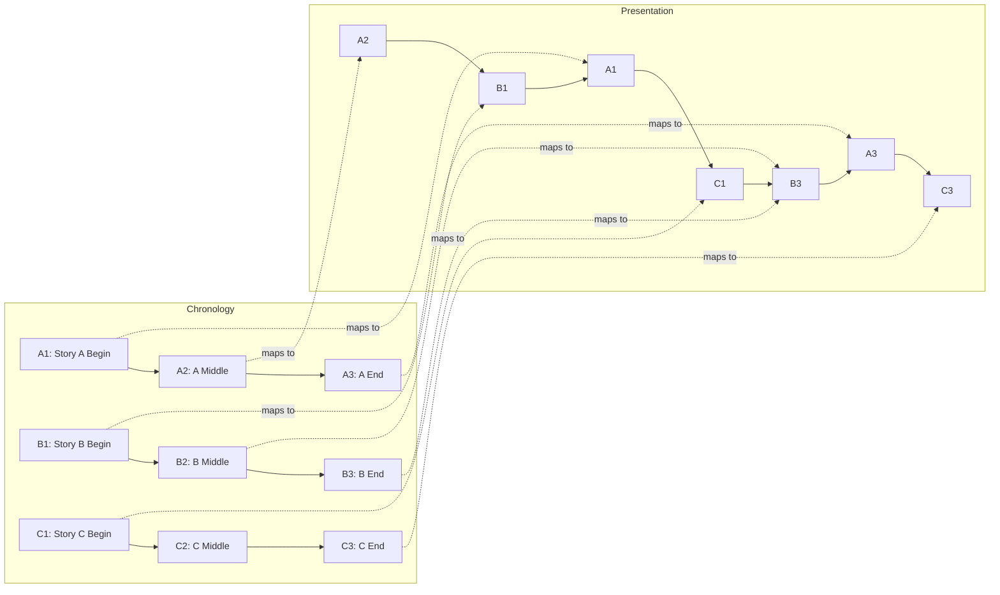

# Pulp Fiction Structure (Circular/Interwoven)

## Overview

Multiple storylines told out of chronological order, with scenes from different timelines interwoven. Made famous by Tarantino's *Pulp Fiction*.

---

## Impactful Guidance

### When to use
- Ensemble stories, multiple perspectives, thematic interweaving, circular endings

### Core promise
- Chronology (example): A1 → A2 → A3; B1 → B2 → B3; C1 → C2 → C3
- Presentation (example): A2 → B1 → A1 → C1 → B3 → A3 → C3 (loops back)

### Labeled Mermaid graph (Chronology vs Presentation)


### Minimal template (LLM-ready)
```yaml
structure: interwoven_circular
stories:
  A: [A1, A2, A3]
  B: [B1, B2, B3]
  C: [C1, C2, C3]
presentation: [A2, B1, A1, C1, B3, A3, C3]
constraints:
  - "Each story arc (A/B/C) has a complete beginning/middle/end"
  - "Presentation order preserves clarity with chapter cards"
  - "Ending connects back thematically or literally to opening"
```

### Quick checklist
- Clear chapter/title cards per storyline
- Minimal intercuts per scene to preserve comprehension
- A final beat that loops back or resolves the opening

## Key Characteristics

### 1. Multiple Storylines
3-5 separate stories that intersect

### 2. Non-Chronological Order
Scenes shown out of time sequence

### 3. Circular Structure
Ending connects back to beginning

### 4. Chapter-Based
Clear divisions between segments

---

## Structure Pattern

```yaml
Chronological_Order:
  - Story A: Beginning
  - Story B: Beginning  
  - Story A: Middle
  - Story C: Beginning
  - Story B: Middle
  - Story A: End
  - Story C: Middle
  - Story B: End
  - Story C: End

Actual_Viewing_Order:
  - Story A: Middle
  - Story B: Beginning
  - Story A: Beginning
  - Story C: Beginning
  - Story B: End
  - Story A: End
  - Story C: End
  - (Loops back to Story A: Middle)
```

---

## For 30-Second Ad

```yaml
structure:
  - Chapter_1 (8s): Customer using product (middle of story)
  - Chapter_2 (7s): How they discovered it (beginning)
  - Chapter_3 (8s): Different customer's experience (separate story)
  - Chapter_4 (7s): First customer's result (end)
  
effect: Creates intrigue, shows multiple perspectives
```

---

## Example: Product Launch

```yaml
Scene_Order:
  S1 (5s): "CHAPTER 3" - Customer C loving product
  S2 (6s): "CHAPTER 1" - Product being designed
  S3 (5s): "CHAPTER 4" - Customer A's testimonial
  S4 (6s): "CHAPTER 2" - First customer trying it
  S5 (5s): "CHAPTER 5" - All customers together
  S6 (3s): Product logo

Chronological_Order: S2 → S4 → S1 → S3 → S5
Viewing_Order: S1 → S2 → S3 → S4 → S5 → S6
```

---

## Visual Indicators

```yaml
chapter_cards:
  - Bold text: "CHAPTER 1", "CHAPTER 2"
  - Different color grades per timeline
  - Time stamps: "3 DAYS EARLIER"

transitions:
  - Hard cuts between chapters
  - Smash cuts for contrast
  - Match cuts for connections
```

---

## When to Use

**Best for**:
- Multiple product benefits
- Different user perspectives
- Complex stories
- Creating mystery/intrigue
- Sophisticated brands

**Avoid for**:
- Simple messages
- Conservative audiences
- Products needing clear explanation
- Time-sensitive offers

---

## Characteristics

- Non-linear timeline
- Multiple perspectives
- Chapter-based structure
- Circular or interwoven
- Requires attention
- Memorable when done well
